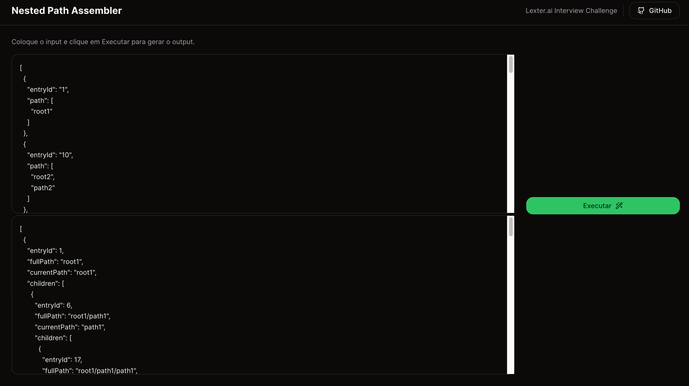

<div id="top"></div>

<!-- PROJECT LOGO -->
<br />
<div align="center">

  <h1 align="center">Nested Path Assembler</h1>

  <p align="center">
    
  </p>
</div>

<!-- TABLE OF CONTENTS -->
<details open>
  <summary>Sumário</summary>
  <ol>
    <li>
      <a href="#about-the-project">Sobre o Projeto</a>
    </li>
    <li>
      <a href="#getting-started">Rodar Projeto</a>
    </li>
    <li><a href="#api">Documentação da API</a></li>
    <li><a href="#contact">Contato</a></li>
  </ol>
</details>


<!-- ABOUT THE PROJECT -->
> ## Sobre o Projeto

Desafio proposto pela Lexter.ai, para desenvolver um algoritmo para receber um Array de Objetos no formato:
```ts
type Input = {
    entryId: number
    path: string[]
}
```
E retornar a montagem de caminhos do `path` ordenados pelo `entryId` no formato:
```ts
type Output = {
    entryId: number;
    fullPath: string;
    currentPath: string;
    children: Output[];
}
```

Para isso foi feito um site usando Next.js e tailwind.css:
https://lexter-algorithm-interview-a1xgozsd5-renan04lima.vercel.app/




<p align="right">(<a href="#top">back to top</a>)</p>


<!-- GETTING STARTED -->
> ## Rodar Projeto

Para rodar o site localmente, segue os seguintes comandos:

```sh
npm install
npm run dev
```

E para rodar os testes unitários:

```sh
npm run test
```

<p align="right">(<a href="#top">back to top</a>)</p>

<!-- API -->
> ## Documentação da API

### Endpoint

- URL: `/api/nested-paths`
- Method: `POST`

### Request

- Content-Type: `application/json`

#### Request Body

```json
[
  {
    "entryId": "1",
    "path": [
      "root1"
    ]
  },
   {
    "entryId": "6",
    "path": [
      "root1",
      "path1"
    ]
  }
]
```

### Responses

#### Status 200
```json
{
  "output": [
    {
      "entryId": 1,
      "fullPath": "root1",
      "currentPath": "root1",
      "children": [
        {
          "entryId": 6,
          "fullPath": "root1/path1",
          "currentPath": "path1",
          "children": []
        }
      ]
    }
  ]
}
```
#### Status 400
```json
{
	"message": "Missing root path: root1"
}
```

```json
{
	"message": "Invalid JSON"
}
```

#### Status 500
```json
{
	"message": "Internal server error"
}
```

#### 

<p align="right">(<a href="#top">back to top</a>)</p>


<!-- CONTACT -->
> ## Contato

[](https://mail.google.com/mail/?view=cm&fs=1&to=renan.backend.engineer@gmail.com&su=Contact)


[](https://www.linkedin.com/in/dev-renan)

<p align="right">(<a href="#top">back to top</a>)</p>
